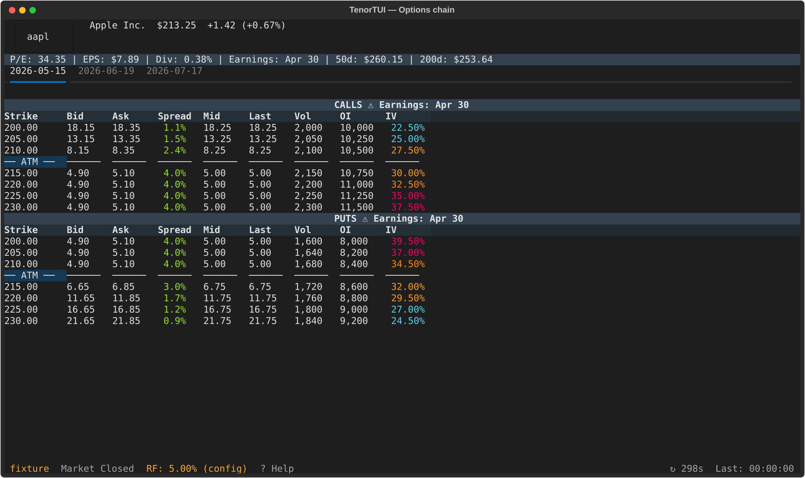
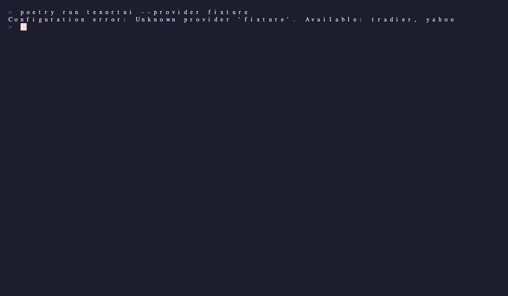

# Options Chain

The options chain is the main view of TenorTUI: calls on the left, puts on the
right, with the at-the-money strike highlighted.

{ loading=lazy }

## Layout

- **Calls table (left):** strike, bid, ask, last, volume, open interest, IV,
  and (if the provider supplies them) Δ Γ Θ ν ρ.
- **Puts table (right):** same columns, mirrored.
- **ATM divider row:** a horizontal divider sits at the strike closest to the
  current underlying price. The view auto-scrolls to keep it centered when you
  load a new chain.

## Expiry tabs

Each expiration date is a tab across the top of the chain. Switch with
<kbd>←</kbd> / <kbd>→</kbd> or click the tab.

{ loading=lazy }

## Greeks columns

Greeks columns appear automatically when the provider supplies them. The
default Yahoo provider does **not** include Greeks; the Tradier provider does.
See [Providers](providers.md) for the full capability matrix.

## Demo

{ loading=lazy }
