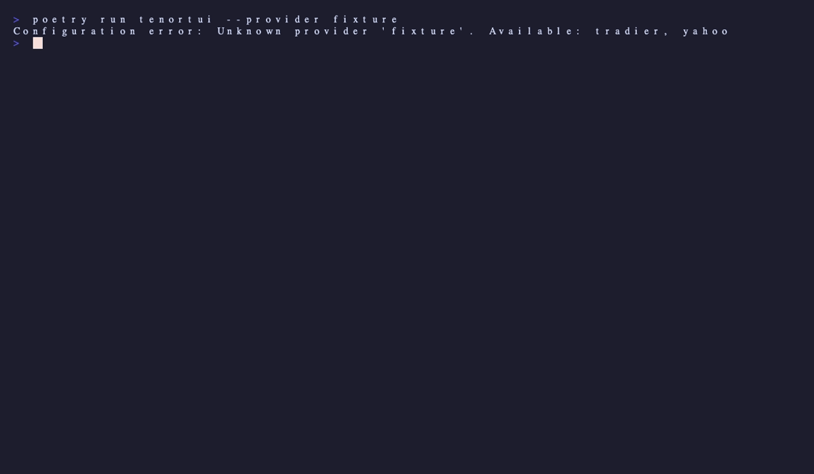

# Watchlists

Watchlists group symbols you care about. They replaced the older "Recently
Viewed" panel — you can have multiple named watchlists, each containing
equity tickers and (optionally) specific options contracts.

{ loading=lazy }

## Keybindings

| Key | Action |
|---|---|
| <kbd>w</kbd> | Open the watchlist picker (add current symbol to a list) |
| <kbd>W</kbd> | Open the watchlist manager (create / rename / delete lists) |
| <kbd>d</kbd> | Delete the focused symbol from its list |
| <kbd>S</kbd> | Sort the focused list (cycles through symbol / price / change / volume) |

## Persistence

Watchlists are stored in `~/.config/tenor/watchlists.json`. The file is JSON,
human-readable, and safe to edit by hand if you want.

## Demo

{ loading=lazy }
