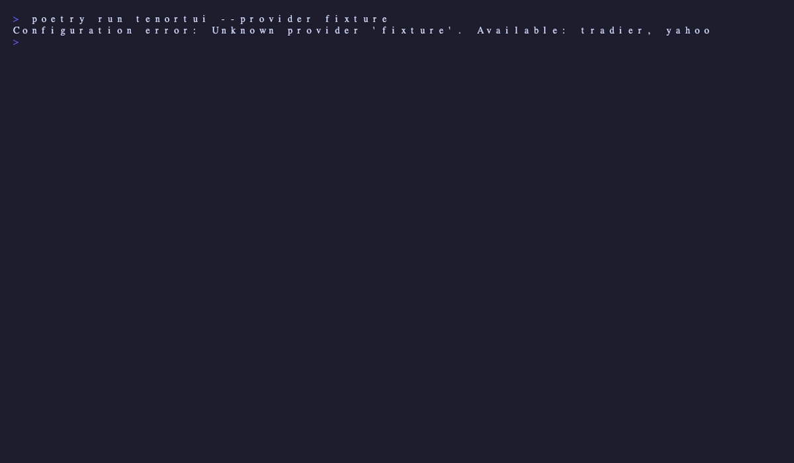

# TenorTUI

A terminal UI for browsing stock options chains. Live quotes, full options chains
with Greeks, named watchlists, and pluggable data providers — all in your terminal.

{ loading=lazy }

## Why a TUI?

- **Fast.** Keyboard-driven. No tab-switching, no clicking, no dashboards to load.
- **Offline-friendly.** Works in any terminal, including over SSH.
- **Composable.** Pipe-friendly architecture; pluggable data providers.
- **Free.** Yahoo Finance provider needs no API keys. Tradier optional.

## Try it in 30 seconds

```bash
pipx install tenor-tui
tenortui
```

Then type `AAPL` (or any ticker) and press Enter.

## See it in action

{ loading=lazy }

## Where next?

- **[Installation](installation.md)** — pipx, pip, or from source
- **[Quickstart](quickstart.md)** — your first 60 seconds with the app
- **[Features](features/options-chain.md)** — the full guided tour
- **[Configuration](configuration.md)** — every option in `~/.config/tenor/config.yaml`
