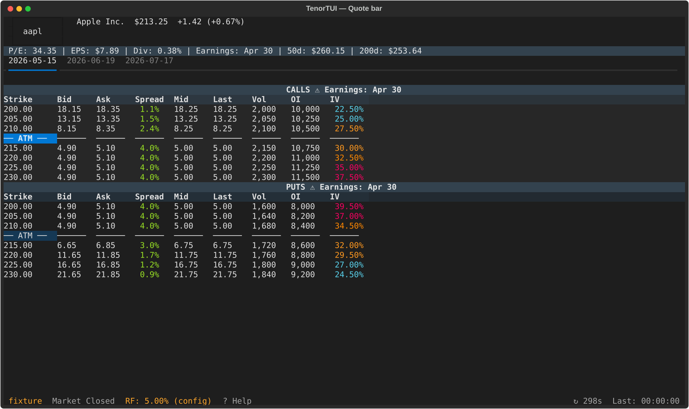
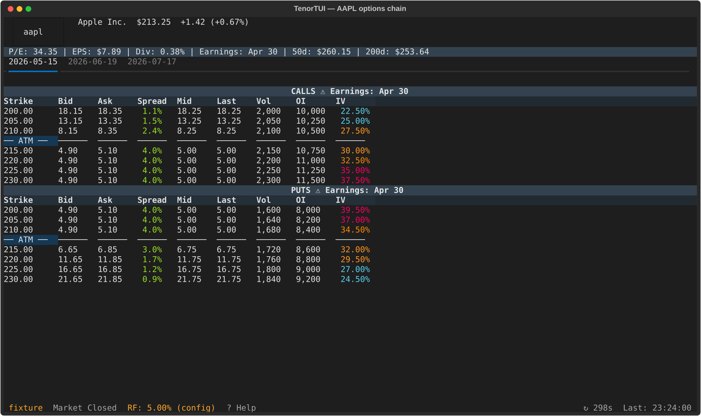
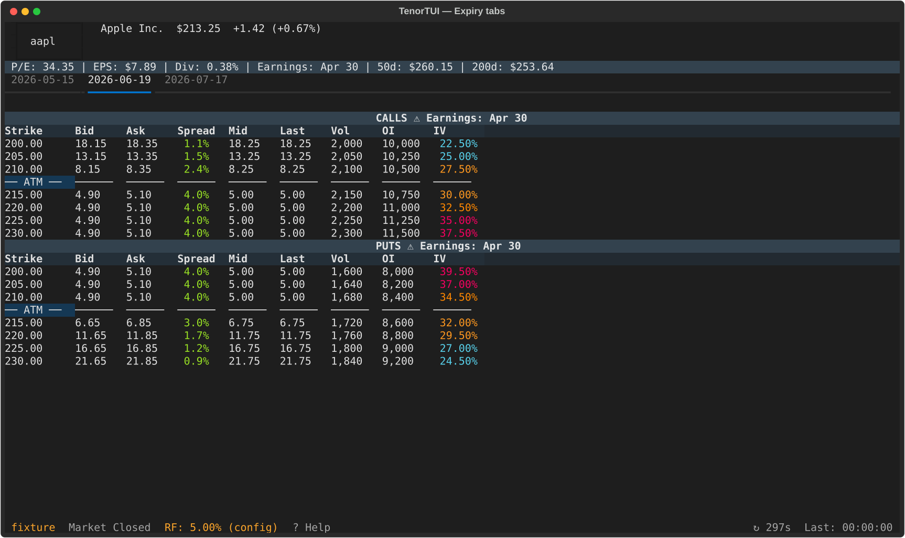
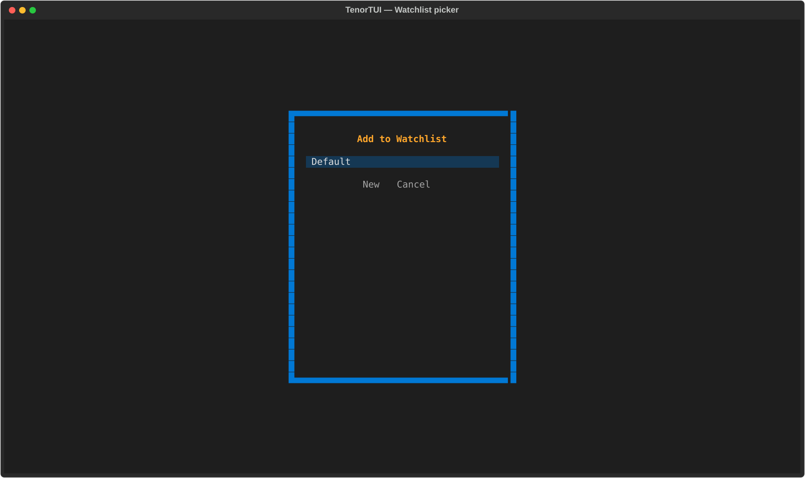

# Quickstart

This guide walks you through your first 60 seconds with TenorTUI.

## 1. Launch

```bash
tenortui
```

The app opens with a search bar at the top and (after your first ticker)
a "Recently Viewed" panel showing your watchlists.

{ loading=lazy }

## 2. Search a ticker

Type a symbol and press <kbd>Enter</kbd>:

```text
AAPL
```

The quote bar populates with the live price, and the options-chain view loads
with calls on the left and puts on the right.

{ loading=lazy }

## 3. Switch expiries

Use <kbd>←</kbd> / <kbd>→</kbd> to switch between expiration date tabs.

{ loading=lazy }

## 4. Add to a watchlist

Press <kbd>w</kbd> to open the watchlist picker. Pick a list (or create one
with <kbd>W</kbd>) and the current symbol is added.

{ loading=lazy }

See the full keybinding reference in [Keybindings](features/keybindings.md).

## What's next

- Browse the [feature walkthrough](features/options-chain.md) to see everything
  the app can do.
- Read about the available [providers](features/providers.md) and how to
  configure them.
- Configure persistent options in `~/.config/tenor/config.yaml` — see
  [Configuration](configuration.md).
